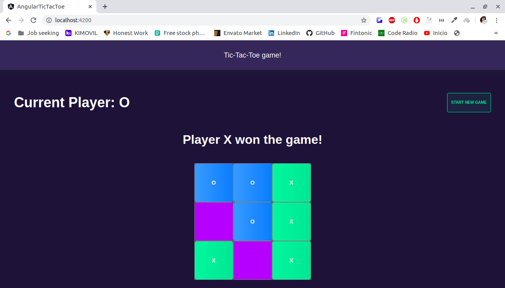
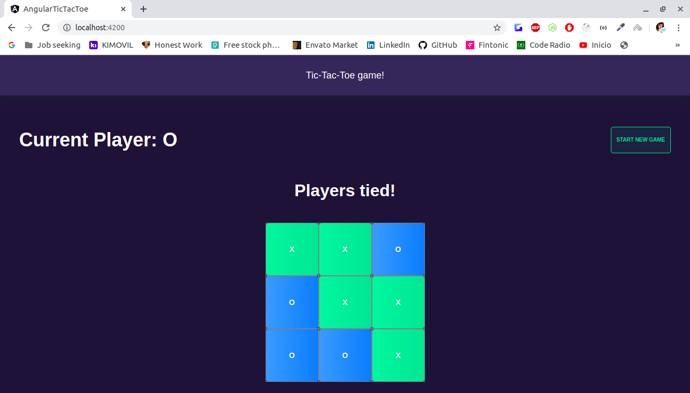

# Tic Tac Toe Game!
Web application built using Angular to play Tic-Tac-Toe

## Screenshots:

## Installation

Download the code from the repository, install it with npm by running the following command:

### `npm install`

And then just start the local Angular server by typing:

### `ng serve`

## Technology Stack
This project was built using Angular and Nebular

## Contributing
All pull requests are welcome.

## License
[MIT](https://choosealicense.com/licenses/mit/)
